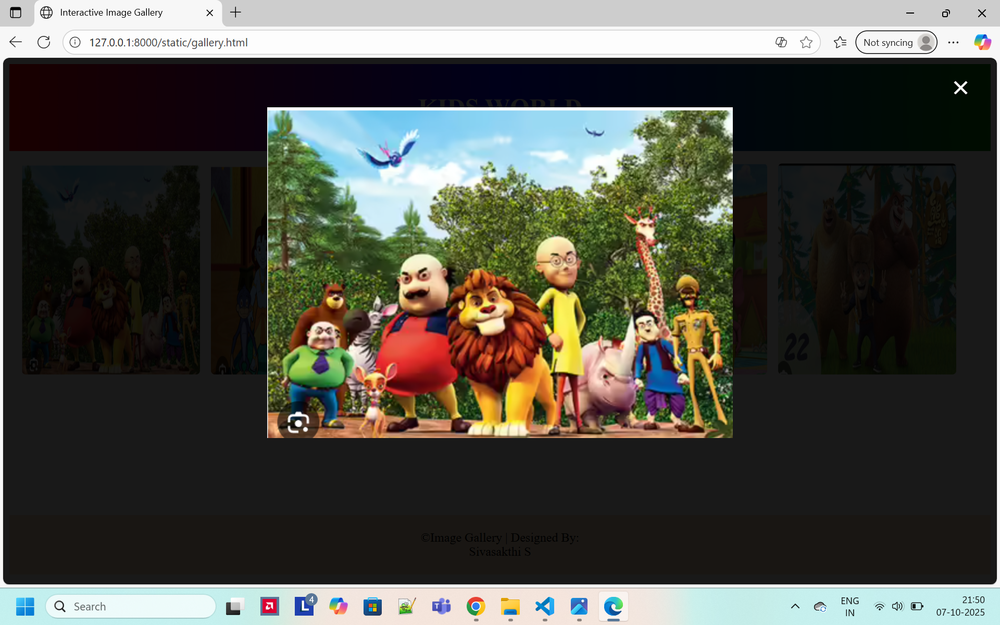

# Ex.08 Design of Interactive Image Gallery
## Date:07-10-2025

## AIM:
To design a web application for an inteactive image gallery with minimum five images.

## DESIGN STEPS:

### Step 1:
Clone the github repository and create Django admin interface.

### Step 2:
Change settings.py file to allow request from all hosts.

### Step 3:
Use CSS for positioning and styling.

### Step 4:
Write JavaScript program for implementing interactivity.

### Step 5:
Validate the HTML and CSS code.

### Step 6:
Publish the website in the given URL.

## PROGRAM :
```
gallery.html

<html>
<head>
  <title>Interactive Image Gallery</title>
  <link rel="stylesheet" href="gallery1.css">
  <script src="gallery11.js"></script>
</head>
<body>
  <header>
    <h1>KIDS WORLD</h1>
  </header>

  <div class="gallery">
    <div class="image-box" onclick="openModal(this)">
      
    </div>
    <div class="image-box" onclick="openModal(this)">
      
    </div>
    <div class="image-box" onclick="openModal(this)">
      
    </div>
    <div class="image-box" onclick="openModal(this)">
      
    </div>
    <div class="image-box" onclick="openModal(this)">
      
    </div>
  </div>

  <div id="modal">
    <span id="close-btn" onclick="closeModal()">&times;</span>
    
  </div>
  <div class="foot">
    &copy;Image Gallery | Designed By:<br>Sivasakthi S
  </div>
</body>
</html>

gallery1.css


header {
  text-align: center;
  background: linear-gradient(to right,red,blue,green);
  color: white;
  padding: 1rem 0;
}

.gallery {
  white-space: nowrap;
  overflow-x: auto;
  padding: 1rem;
}

.image-box {
  display: inline-block;
  margin-right: 10px;
  cursor: pointer;
}

.image-box img {
  height: 270px;
  width: 228px;
  border-radius: 5px;
  transition: transform 0.3s;
}

.image-box img:hover {
  transform: scale(1.10);
}

#modal {
  display: none;
  position: fixed;
  z-index: 10;
  left: 0;
  top: 0;
  width: 100%;
  height: 100%;
  background-color: rgba(0,0,0,0.9);
}

#modalImage {
  display: block;
  margin: 5% auto;
  max-width: 80%;
}

#close-btn {
  position: absolute;
  top: 15px;
  right: 35px;
  color: white;
  font-size: 40px;
  font-weight: bold;
  cursor: pointer;
}

.foot{
    background-color: bisque;
    text-align: center;
    margin-top:160px;
    padding: 20px;
}

gallery11.js

function openModal(element) {
  const modal = document.getElementById("modal");
  const modalImg = document.getElementById("modalImage");

  modal.style.display = "block";
  modalImg.src = element.querySelector("img").src;
}

function closeModal() {
  document.getElementById("modal").style.display = "none";
}


```

## OUTPUT:


## RESULT:
The program for designing an interactive image gallery using HTML, CSS and JavaScript is executed successfully.
